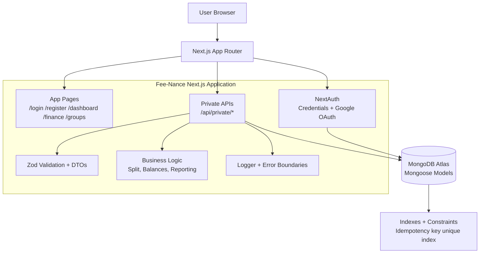
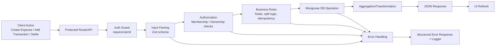

# Architecture Diagram and Module Flow

## 1. High-Level Architecture

## 2. Module Flow (Request Lifecycle)

## 3. Core Runtime Modules

- Authentication and sessions: `src/lib/auth.ts`, `middleware.ts`
- Data access and connection: `src/lib/db.ts`, `src/models/*.ts`
- Validation and HTTP helpers: `src/lib/http.ts`, route DTOs
- Personal finance APIs: `src/app/api/private/transactions`, `budgets`, `categories`, `finance/aggregate`
- Group expense APIs: `src/app/api/private/groups/**`
- Split and balance logic: `src/lib/split.ts`, group balance routes
- Reporting for DBMS mapping: `src/lib/dbms-reporting.ts`, `src/scripts/dbms-report.ts`
