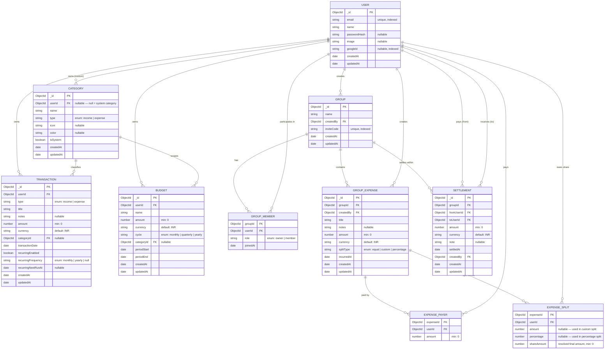

# Fee-Nance — Entity-Relationship Diagram

## Entities and Relationships

## Embedded vs Relational Notes

| MongoDB Embedding | Relational Equivalent | Rationale |
|---|---|---|
| `Transaction.recurring` (sub-doc) | Flattened columns on `TRANSACTION` | Always accessed together; no independent lifecycle |
| `Group.members[]` (array of sub-docs) | Separate `GROUP_MEMBER` junction table | Small bounded set; queried via `$elemMatch` on groupId |
| `GroupExpense.paidBy[]` | Separate `EXPENSE_PAYER` junction table | Bounded to group members; queried only via parent expense |
| `GroupExpense.splits[]` | Separate `EXPENSE_SPLIT` junction table | Bounded to group members; computed at write time |
